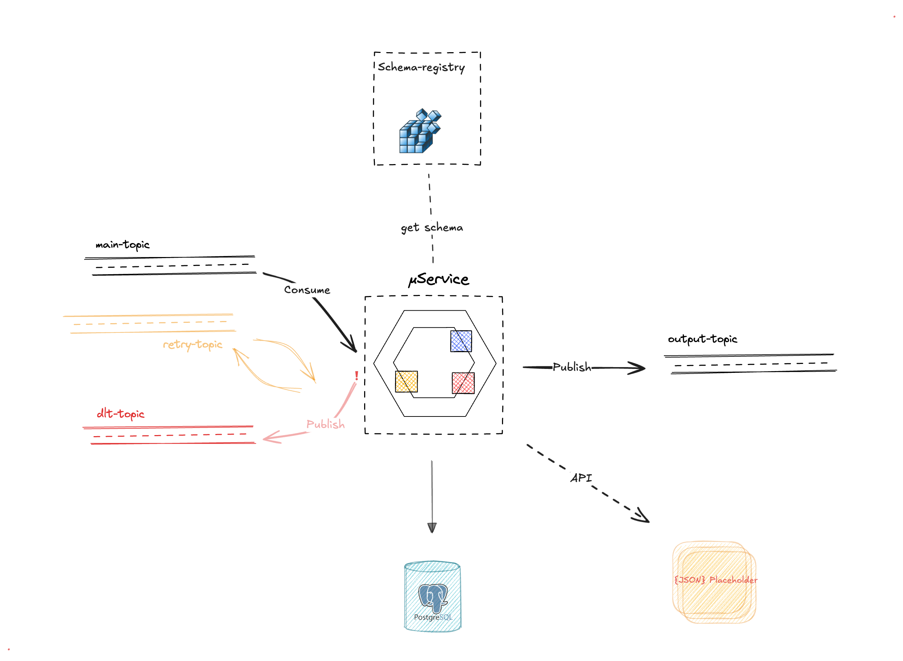
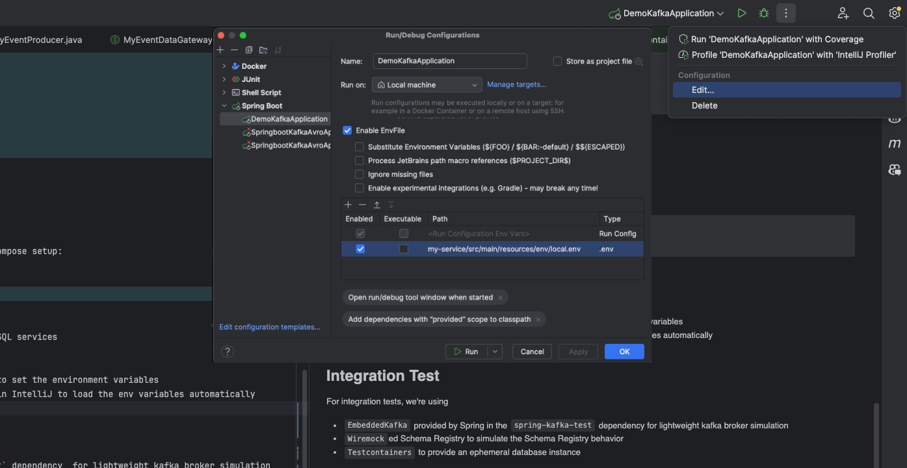

## Kafka Avro Serialization with Schema Registry 


## About

> This project provides a sample implementation of **Spring Boot microservice** that integrates **Kafka** with **Avro** schema and communicate with an external API & a relational database 

> [!NOTE]  
> The focus is on providing a robust **testing** setup that ensures the microservice behaves as expected in a real-world environment.
> A Gherkin [scenario]((https://github.com/smaillns/springboot-kafka-avro/blob/tzatziki/my-service/src/test/resources/features/kafka.feature)) for an **integration test** is included, implemented using [Tzatziki framework](https://github.com/Decathlon/tzatziki).  
> There is an equivalent [test](https://github.com/smaillns/springboot-kafka-avro/blob/master/my-service/src/test/java/com/example/demo/demokafka/TestIT.java) for the classic method using **Testcontainers** and **Embedded Kafka**.


<div >
  
  <p><em>Solution Architecture</em></p>
</div>

> The μService follows the **Hexagonal** (or ports/adapter) architecture to ensure clear separation of concerns and maintainability :
> - **Core Domain**: Contains the business logic and domain models.
> - **Ports**: Define interfaces for incoming and outgoing interactions.
> - **Adapters**: Implement the interfaces defined by the ports


## Project Structure

The project is modular, consisting of:
- `avro-schema`: A module for Avro schemas generation and management.
- `my-service`: The main service module that includes the Spring Boot application, the kafka configuration and the integration tests

the directory structure of the project is as follows
```
project/
├── avro-schema/
│   ├── src/
│   │   ├── main/
│   │   │   ├── avro/
│   └── pom.xml
├── my-service/
│   ├── src/
│   │   ├── main/java/
│   │   |        ├──  common
│   │   |        ├──  config
│   │   |        ├──  core
│   │   |            ├──  adpater
│   │   |            ├──  domain  
│   │   |            ├──  port
                 └── Application.java
│   │   ├── test/
            └── test.feature
│   └── pom.xml
├── scripts/
│   ├── docker/
│   │   └── docker-compose.yml
│   └── akhq/
│       ├── akhq-config.yml
│       └── akhq.jar
├── pom.xml
└── README.md
```


## Local Development with Docker


### Prerequisites

- Docker and Docker Compose
- Java 23
- Maven


### Docker Compose

To launch Kafka and Schema Registry locally, use the provided `docker-compose.yml` file in the `/scripts` folder.

```sh
docker-compose up -d
```
After running the docker-compose command, you should have running services, a Kafka broker, and a Schema Registry accessible from the local machine 🎉

### AKHQ
> Note: AKHQ is an optional tool to manage and monitor your Kafka topics and schemas through a UI.

You need to first to download the AKHQ jar, you can use the following link [Download AKHQ](https://akhq.io/docs/installation.html)

To launch AKHQ, run the following commnad
```sh
java -Dmicronaut.config.files=scripts/akhq/akhq-config.yml -jar scripts/akhq/akhq.jar
```

This will start AKHQ with the specified configuration file, allowing you to manage and monitor your Kafka topics and schemas.

## Configuration


### Kafka Configuration
The current configuration uses a retry topic and a DLT (Dead Letter Topic). The number of retries, delay, and other properties are configured in the application configuration files.

**Example Configuration**

```yaml
app:
  kafka:
    my-consumer:
      topic:
        main: my-main-topic
        retry: my-retry-topic
        error: my-dlt-topic
      client-id: my-client-id
      group-id: my-group-id
      enabled: true
    schema-registry:
      url: http://localhost:8081
```

## Running the application
Before starting the application, follow these steps:

1 - **Start the required services** by launching the Docker Compose setup:
    
```sh
cd scripts/docker
docker-compose up -d
```
This will start the Kafka broker, Schema Registry and PostgreSQL services

2- Configure environment variables:
- You can use `local.env` in your intelliJ run configuration to set the environment variables
- **Note**: you may need to install the **Env File** plugin in IntelliJ to load the env variables automatically
<div >
  
</div>

## Integration Test

For integration tests, we're using
- `EmbeddedKafka` provided by Spring in the `spring-kafka-test` dependency  for lightweight kafka broker simulation
- `Wiremock`ed Schema Registry to simulate the Schema Registry behavior
- `Testcontainers` to provide an ephemeral database instance


### Running Tests
To run the integration tests, run:
    
```sh   
mvn clean test
```

> [!NOTE]
> Ensure you have a Docker environment running before executing the tests.
> If you are using Colima for Docker, you may encounter issues with Testcontainers. To resolve them, set the following environment variables before running the tests:
>```sh
>export DOCKER_HOST=unix:///Users/<your-username>/.colima/default/docker.sock
>export TESTCONTAINERS_RYUK_DISABLED=true
>```


-----

